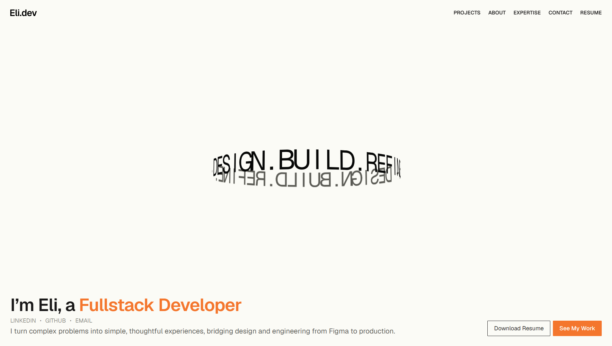

# Eli Dizon Portfolio

My personal portfolio highlights both design and development expertise while building thoughtful digital experiences with React, TypeScript, and modern web technologies.

Credits for design inspiration go to:

- [SpaceTypeGenerator](https://spacetypegenerator.com/)
- [shadcn.io components](https://shadcn.io/)
- [Osmo Supply](https://www.osmo.supply/preview?resource=gradient-wave-text-on-scroll)
- [A24](https://a24films.com/)

## Live Portfolio

[elidizon.vercel.app](https://elidizon.vercel.app/)

## Screenshot



## Tech Stack

[](https://skillicons.dev)

- TypeScript
- React 19
- Next.js 16
- Tailwind CSS 4
- Three.js
- GSAP
- Vercel

## Features

- Reduced initial JavaScript transfer by ~200 kB by moving Three.js/React Three Fiber runtime into a separate dynamically loaded bundle
- Achieved 100/100 Lighthouse Performance, Best Practices, and SEO scores with 96/100 Accessibility, optimized to 0.5s LCP, 50ms TBT, and 0 CLS
- Three.js cylinder text
- Scroll-based philosophy text animation

## Project Structure

```text
src/
├── app/
│   ├── page.tsx
│   ├── layout.tsx
│   ├── template.tsx
│   ├── globals.css
│   └── projects/
│       ├── billease/
│       └── ust-technovation-society/
├── components/
│   ├── case-studies/
│   ├── layout/
│   ├── sections/
│   └── ui/
├── hooks/
└── lib/
```

## Setup

### Requirements

- Node.js 20.9 or later
- npm

## Installation

```bash
git clone https://github.com/EliDzn/eli-dizon-portfolio.git
cd eli-dizon-portfolio
npm install
```

## Development

```bash
npm run dev
```

Open http://localhost:3000 in your browser.

## Lint

```bash
npm run lint
```

## Production Build

```bash
npm run build
npm run start
```

## Bundle Analysis

```bash
npm run analyze
```

## Deployment

### Vercel

1. Import the repository into [Vercel](https://vercel.com/).
2. Select **Next.js** as the framework.
3. Use `npm install` as the install command.
4. Use `npm run build` as the build command.
5. Deploy the project.

Vercel detects the Next.js configuration automatically.

## License

This project is licensed under the terms in the [LICENSE](./LICENSE).
